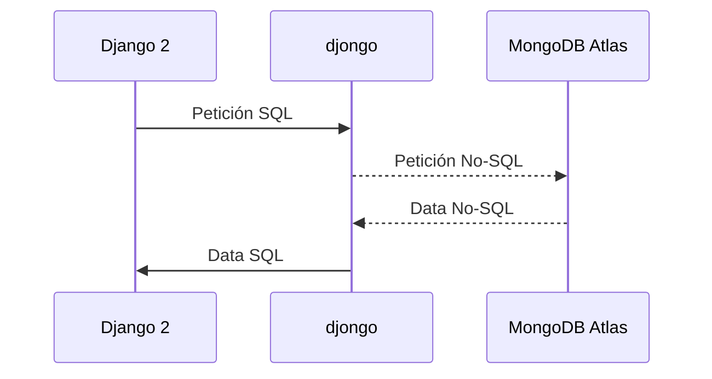
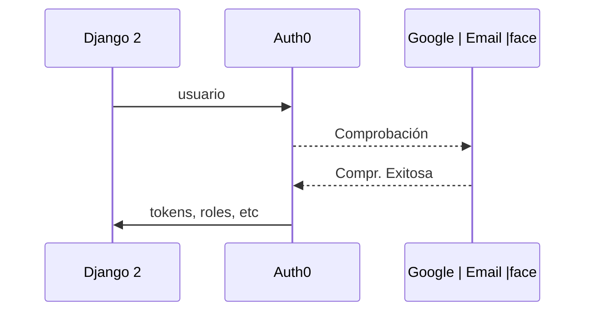

# Proyecto Biblioteca

Proyecto en fase beta de una Biblioteca virtual.


# Requisitos

 - Ubuntu 18.04
 - Servicio MongoDB
 - Servicio Auth0
 - Django 2.1.4
 - Otros especificados en el archivo **requirements.txt**

## Instalación

Para la instalación solamente se requiere correr el siguiente comando dentro del directorio:
```
sudo pip install -r requirements.txt
```

## Inicialización
```
AUTH0_CLIENT_ID="<..clave_completar..>" AUTH0_CLIENT_SECRET="<..clave_completar..>" USER_MONGO="<usuario_mongo>" PASS_MONGO="<clave_mongo>" python3 manage.py runserver
```


## Servicios externos usados

### MongoDB


### Auth0



# License GLP v3

